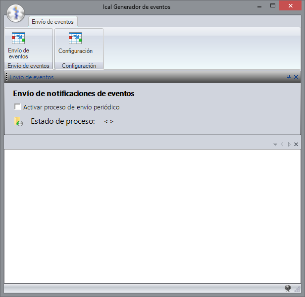
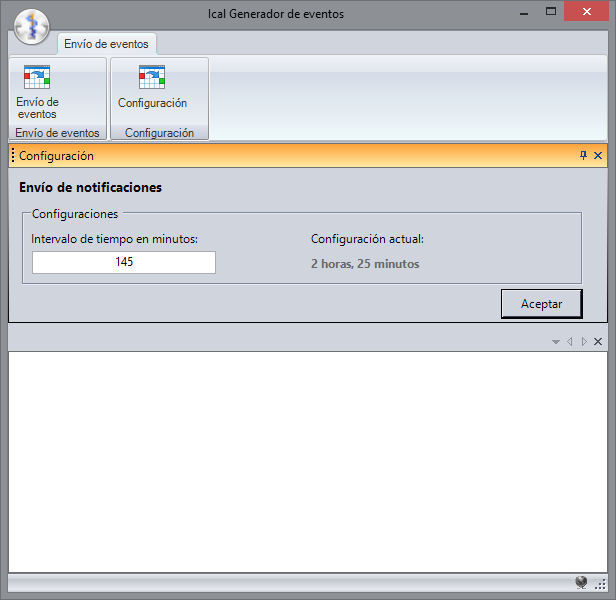

[comment]: <> (Nombre original: ICalendar Creator)
[comment]: <> (Fecha de creación: 10 de Junio de 2019)
[comment]: <> (Autor: Héctor Martínez <hector.mtz.grc@gmail.com>)
[comment]: <> (🈷️)
[comment]: <> (Kanji con furigana {漢字|かんじ} => <ruby>漢字<rt>かんじ</rt></ruby> {漢字|かん|じ} => <ruby>漢<rt>かん</rt>字<rt>じ</rt></ruby>)
[comment]: <> (心 秋雨)

# Notificaciones Al Correo

## Generador automático de archivos de eventos y notificaciones de cirugía programada y citas médicas

---

### ️️️ℹ️ Descripción de funciones de la aplicación.

---

## Descripción general

### La aplicación tiene cómo propósito general crear archivos estándar RFC 5545 de formatos de internet, mejor conocido cómo ICalendar. Hasta el momento de edición de este archivo existen tres especificaciones para crear archivos los cuáles están definidos según los códigos RFC 5545, RFC 5546 y RFC 6868 de tipo ICalendar (*.ics, *.ical).

## Atributos de archivo

* Nombre común: ICalendar
* Especificación: RFC 5545
* Extensiones conocidas: *.ics, *.ical
* Tipo mime: text/calendar

### Se puede consultar más información sobre la estructura de la especificación que se usa para crear archivos en esta aplicación en el siguiente enlace:

> ### 🌐 <https://tools.ietf.org/html/rfc5545>

<br>

## Descripción de funciones de aplicación

### La aplicación crea archivos de eventos con datos de una cirugía programada y los envía por correo a los mestarían encargados de dicha cirugía. El médico que quedaría en el archivo de eventos cómo organizador sería el cirujano responsable de la cirugía y los demás quedarían como invitados en el evento. Todos los participantes de  la cirugía reci birán un correo, en caso de que éste haya sido configurado para cada médico.

### La aplicación trabaja según un intervalo de tiempo especificado en  minutos. Una vez que pasa el tiempo que se ha determinado, revisa qué cirugías programadas están pendientes de ser notificadas y recupera sus datos para posteriormente enviar un archivo de evento compatible con diferentes tipos de aplicaciones de agenda/calendario.

<br>

[📷 Pantalla de envío de eventos:]()



<br>

## Componentes base

### A continuación se describen las dependencias y componentes necesarios para poder ejecutar y editar la aplicación. Asegúrese de contar con todas las dependencias antes de iniciar.

### 🔨 Base de datos

* 🔧 Procedimientos
  * 👥 Compartidos
    * 🔧 ppRegistrarEventoAgenda
  * 👤 Cirugía programada
    * 🔧 ppObtenerAsistentesAgenda
    * 🔧 ppGenerarEventoAgenda
    * 🔧 ppObtenerCirugiasPrograAgenda
  * 👤 Cita médica
    * 🔧 ppObtenerCitaMedicaAgenda
    * 🔧 ppGenerarEventoAgendaCita
    * 🔧 ppObtenerAsistentesCitaAgenda

* 📄 Tablas
  * 📄 CatRegistroEventoAgenda

* 🔩 Parámetros
  * 🔩 Parámetro 470
    * Dirección del servidor SMTP
  * 🔩 Parámetro 471
    * Dirección del correo electrónico
  * 🔩 Parámetro 472
    * Contraseña del correo electrónico
  * 🔩 Parámetro 133831
    * Puerto del servidor SMTP
  * 🔩 Parámetro 133832
    * Activar/Desactivar SSL
  * 🔩 Parámetro 134061 💡
    * Intervalo de días de límite para buscar cirugías programadas

### 📚 Dependencias de la aplicación

* 📚 Internas
  * 📓 Medisist.Util
  * 📓 Medisist.Framework
* 📚 Externas
  * 📓 Ical.Net
  * 📓 Antlr.Runtime
  * 📓 NodaTime

<br>

> ️️️️ℹ️ Las dependencias externas se importan desde un único paquete de NuGet. El paquete está disponible desde el enlace: <https://www.nuget.org/packages/Ical.Net/>

> ⚠️ Las dependencias externas que se usan en esta aplicación son de la versión 2.1.1 ya que esta versión es la única disponible que soporta .NET Framework 4.0.

> ⚠️ Si se desea cambiar la versión de la dependencia, en algunas versiones más recientes la API cambia ligeramente de nombre, por lo que se tendría que editar algunos componentes de la aplicación.

> 💡 Este parámetro es nuevo. Está incluido en el script adjunto de la aplicación. El resto de los parámetros ya son parte del sistema.

> ℹ️ Para agregar más tipos de envíos se debe agregar un controlador nuevo basado en las funcionalidades de los que ya existen.

<br>
<br>
<br>
<br>
<br>
<br>
<br>

## Descripción de dependencias de base de datos

### 🔧 **ppRegistrarEventoAgenda**: Se encarga de registrar las cirugías de las que se han creado eventos y han sido enviados.

``` text
🔩 Parámetros/Datos de entrada esperados:

🆔 @iFolioEvento: Código de (cirugía/cita médica) / Código del episodio / Código de evento
Tipo de dato: 🔢 Entero (Integer)

🆔 @iTipoEvento: Código de tipo de evento (cirugía: 0 / cita médica: 1)
Tipo de dato: 🔢 Entero (Integer)

#️⃣  Datos que retorna:
No retorna ningún dato
```

<br>

### 🔧 **ppObtenerAsistentesAgenda**: Se encarga de recuperar los médicos que participan en la cirugía, con excepción del cirujano responsable.

``` text
🔩 Parámetros/Datos de entrada esperados:

🆔 @iFolioEvento: Código de cirugía / Código del episodio / Código de evento
Tipo de dato: 🔢 Entero (Integer)

#️⃣  Datos que retorna:
Conjunto de datos de los asistentes del evento
```

<br>

### 🔧 **ppGenerarEventoAgenda**: Se encarga de obtener los datos necesarios para llenar el modelo del archivo de eventos en la aplicación. Básicamente, los datos que este procedimiento regresa son el archivo de ICalendar sin formato.

``` text
🔩 Parámetros/Datos de entrada esperados:

🆔 @iFolioEvento: Código de cirugía / Código del episodio / Código de evento
Tipo de dato: 🔢 Entero (Integer)

#️⃣  Datos que retorna:
Modelo de datos de evento de cirugía
```

<br>

### 🔧 **ppObtenerCirugiasPrograAgenda**: Se encarga de obtener las cirugías pendientes. Revisa las cirugías que hay desde el día actual y la hora actual y hasta una semana después o según el intervalo que se haya configurado. Quedando cómo ejemplo lo siguiente:

``` text
🔩 Parámetros/Datos de entrada esperados:
No recibe ningún dato

#️⃣ Datos que retorna:
Conjunto de identificadores de cirugías programadas
```

> 💡 Teniendo en cuenta que cómo ejemplo la fecha actual es: 1 de Enero de 2019 14:00, se retornarían las cirugías que estén programadas desde el 1 de Enero de 2019 a las 14:00 hasta una semana después o la fecha que se haya proporcionado en cuestión.

<br>

### 🔧 **ppObtenerCitaMedicaAgenda**: Se encarga de obtener las citas médicas pendientes. Revisa las citas médicas que hay desde el día actual y la hora actual y hasta una semana después o según el intervalo que se haya configurado.

``` text
🔩 Parámetros/Datos de entrada esperados:
No recibe ningún dato

#️⃣ Datos que retorna:
Conjunto de identificadores de cirugías programadas
```

<br>

### 🔧 **ppGenerarEventoAgendaCita**: Se encarga de obtener los datos necesarios para llenar el modelo del archivo de eventos en la aplicación. Básicamente, los datos que este procedimiento regresa son el archivo de ICalendar sin formato.

``` text
🔩 Parámetros/Datos de entrada esperados:

🆔 @iFolioEvento: Código de cita médica / Código del episodio / Código de evento
Tipo de dato: 🔢 Entero (Integer)

#️⃣ Datos que retorna:
Modelo de datos de evento de cita médica
```

<br>

### 🔧 **ppObtenerAsistentesCitaAgenda**: Se encarga de recuperar los médicos o pacientes que participan en la cita médica.

``` text
🔩 Parámetros/Datos de entrada esperados:

🆔  @iFolioEvento: Código de cita médica / Código del episodio / Código de evento
Tipo de dato: 🔢 Entero (Integer)

#️⃣ Datos que retorna:
Conjunto de datos de los asistentes del evento
```

<br>

### 📄 **CatRegistroEventoAgenda**: Esta tabla tiene cómo propósito tener un registro de cuáles cirugías ya han sido notificadas a sus participantes y mantener el control sobre cuándo fue hecho el envío y si se envió más de una vez.

<br>

**📄 Campos de la tabla:**

🆔 Nombre de columna | 💡 Descripción                                | #️⃣ Tipo de dato
---------------------|-----------------------------------------------|-----------------
iIdEventoAgenda      | Identificador interno de la tabla             | 🔢 Entero
iFolioEvento         | Identificador de la cirugía                   | 🔢 Entero
iEnviado             | Bandera para indicar si fue envíado el evento | 🔢 Entero
iIntentosEnvio       | Cantidad de intentos de envío                 | 🔢 Entero
dtFechaEnvio         | Fecha de envío                                | 📅 Fecha y hora
iTipoEvento          | Tipo de evento (0: Cirugía, 1: Cita médica)   | 🔢 Entero

<br>

## Configuración de la aplicación

### La aplicación permite definir un intervalo entre el que se revisarán, generarán y se enviarán archivos. Este intervalo se define directamente desde la opción de «Configuración» y se proporciona la cantidad de tiempo en minutos. Ésta configuración se almacena por defecto en un archivo de configuración JSON (*.json) con los siguientes atributos:

* Nombre predeterminado:
  * > 📃 IcalCreatorSettings.json
  
* Origen predeterminado:
  * > 📁 C:``\``Users``\``%username%``\``.IcalCreator

<br>

> ⚠️ Para cambiar la ruta predeterminada de configuración así cómo el archivo se necesitará modificar el modelo de la datos de configuración de la aplicación.

``` text
📁 Ruta del modelo de configuración

↪️ └──📂 NotificacionesAlCorreo
  ↪️ ️ └──📂 Source
    ↪️   └──📂 Settings
      ↪️    └──📃 AppSettingsValues

```

> ⛔ Nunca se debe de editar el archivo de configuración con algún programa externo; esto podría provocar un mal funcionamiento de la aplicación.


[📷 Pantalla de configuración:]()



<br>

## Registro de errores

### La aplicación crea un archivo de registro de errores cada que se presente algún tipo de inconveniente o excepción. El archivo se crea en la misma ruta en dónde se guardan las configuraciones de la aplicación:

> 📁 C:``\``Users``\``%user%``\``.IcalCreator

### El nombre del archivo de error es asignado según la fecha en que se presenta el error, quedando cómo ejemplo el siguiente formato:

> 📃 IcalCreator_\<FechaDeIncidencia\>.log

### Quedando de la siguiente manera suponiendo como ejemplo que la fecha actual es 1 de Enero de 2019:

> 📃 IcalCreator_2019-01-01.log

### Dentro del archivo de registro de errores se usa el siguiente formato:

> 💻 Equipo: \<Nombre del equipo o computadora dónde se está ejecutando la aplicación\> <br>
> 📅 Fecha: \<Fecha y hora en la que se reporta el error\> <br>
> 👤 Usuario: \<Usuario del sistema Enlace\><br>
> ⛔ Error: \<Descripción del error ocurrido\><br>
> ⛔ InnerException: \<Pila de llamadas y descripción de error\>

<br>

---

#### ℹ️ Información del documento: 

* ##### 📅 Fecha de creación: 10 de Junio de 2019

* ##### 📅 Fecha de última modificación: 19 de Junio de 2019

* ##### 👨‍💻 Autor: Héctor Eduardo Martínez García - <hector.mtz.grc@gmail.com>

---

